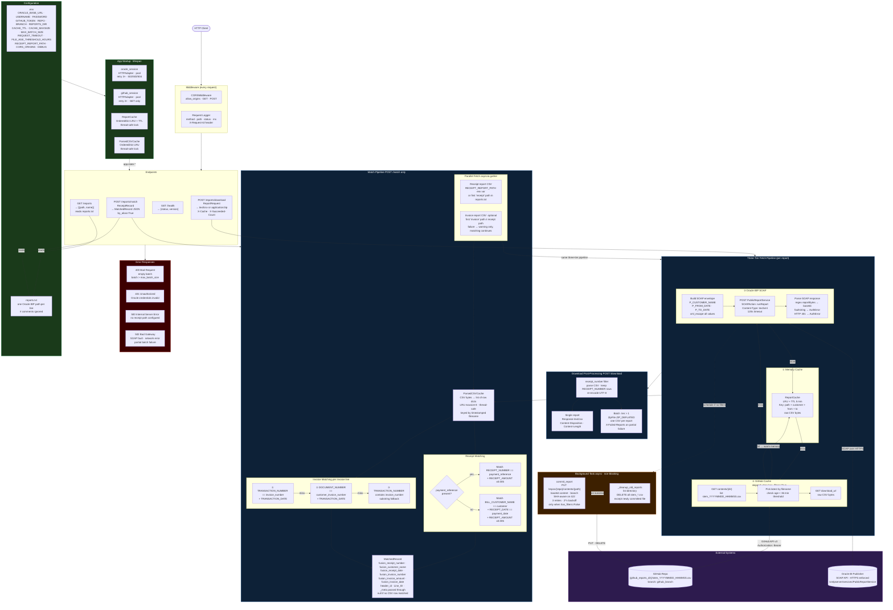

# Architecture

```mermaid
---
id: 31a19f4c-680a-46ce-a666-5a77935af75a
---
flowchart TB
    Client(["HTTP Client"])

    subgraph Init["App Startup · lifespan"]
        direction LR
        I1["oracle_session\nHTTPAdapter · pool\nretry 3× · 502/503/504"]
        I2["github_session\nHTTPAdapter · pool\nretry 2× · GET only"]
        I3["ReportCache\nOrderedDict LRU + TTL\nthread-safe lock"]
        I4["ParsedCSVCache\nOrderedDict LRU\nthread-safe lock"]
    end

    subgraph MW["Middleware  (every request)"]
        direction LR
        CORS["CORSMiddleware\nallow_origins · GET · POST"]
        RLOG["Request Logger\nmethod · path · status · ms\nX-Request-Id header"]
    end

    subgraph EP["Endpoints"]
        direction LR
        H["GET /health\n→ {status, version}"]
        R1["GET /reports\n→ [{path, name}]\nreads reports.txt"]
        R2["POST /reports/download\nReportRequest\n→ text/csv or application/zip\nX-Cache · X-Succeeded-Count"]
        R3["POST /reports/match\nReceiptRecord\n→ MatchedRecord JSON\nby_alias=True"]
    end

    subgraph FP["Three-Tier Fetch Pipeline  (per report)"]
        direction LR

        subgraph T1["① Memory Cache"]
            MC["ReportCache\nLRU + TTL 5 min\nKey: path + customer + from + to\nraw CSV bytes"]
        end

        subgraph T2["② GitHub Cache\nskipped when has_filters=True"]
            GH1["GET contents/{dir}\nlist stem_YYYYMMDD_HHMMSS.csv"]
            GH2["Pick latest by filename\ncheck age < 36 min threshold"]
            GH3["GET download_url\nraw CSV bytes"]
            GH1 --> GH2 --> GH3
        end

        subgraph T3["③ Oracle BIP  SOAP"]
            OE["Build SOAP envelope\nP_CUSTOMER_NAME\nP_FROM_DATE · P_TO_DATE\nxml_escape all values"]
            OP["POST PublicReportService\nSOAPAction: runReport\nContent-Type: text/xml\n120s timeout"]
            OR["Parse SOAP response\nregex reportBytes → base64\nfaultstring → AuthError\nHTTP 401 → AuthError"]
            OE --> OP --> OR
        end

        MC -->|miss| T2
        T2 -->|miss| T3
        T2 -->|"hit → warm memory"| MC
        T3 -->|store| MC
    end

    subgraph DP["Download Post-Processing  POST /download"]
        direction TB
        RF["receipt_number filter\nparse CSV · keep RECEIPT_NUMBER rows\nre-encode UTF-8"]
        SIN["Single report\nResponse text/csv\nContent-Disposition · Content-Length"]
        BAT["Batch  len > 1\nZipFile ZIP_DEFLATED\none CSV per report\nX-Failed-Reports on partial failure"]
        RF --> SIN & BAT
    end

    subgraph MP["Match Pipeline  POST /match only"]
        direction TB

        subgraph PF["Parallel Fetch  asyncio.gather"]
            PFR["Receipt report CSV\nRECEIPT_REPORT_PATH env var\nor first 'receipt' path in reports.txt"]
            PFI["Invoice report CSV  optional\nfirst 'invoice' path ≠ receipt path\nfailure → warning only, matching continues"]
        end

        PCC["ParsedCSVCache\nCSV bytes → list of row dicts\nLRU maxsize 8 · thread-safe\nkeyed by timestamped filename"]

        subgraph RM["Receipt Matching"]
            RMQ{"payment_reference\npresent?"}
            RMA["Match RECEIPT_NUMBER == payment_reference\n+ RECEIPT_AMOUNT ±0.005"]
            RMB["Match BILL_CUSTOMER_NAME == customer\n+ RECEIPT_DATE == payment_date\n+ RECEIPT_AMOUNT ±0.005"]
            RMQ -->|yes| RMA
            RMQ -->|no| RMB
        end

        subgraph IM["Invoice Matching  per invoice line"]
            IMA["① TRANSACTION_NUMBER == invoice_number\n+ TRANSACTION_DATE"]
            IMB["② DOCUMENT_NUMBER == customer_invoice_number\n+ TRANSACTION_DATE"]
            IMC["③ TRANSACTION_NUMBER contains invoice_number\nsubstring fallback"]
            IMA -->|miss| IMB -->|miss| IMC
        end

        MO["MatchedRecord\nfusion_receipt_number · fusion_customer_name\nfusion_receipt_date · fusion_invoice_number\nfusion_invoice_amount · fusion_invoice_date\nheader_id · Line_ID · _meta passed through\nnull if no CSV row matched"]

        PF --> PCC
        PCC --> RM & IM --> MO
    end

    subgraph BT["Background Task  async · non-blocking"]
        direction LR
        BC["commit_report\nPUT /repos/{repo}/contents/{path}\nbase64 content · branch\nSHA-aware on 422\n3 retries · 2^n backoff\nonly when has_filters=False"]
        BD["_cleanup_old_reports\nlist directory\nDELETE all stem_*.csv\nexcept newly committed file"]
        BC -->|on success| BD
    end

    subgraph ERR["Error Responses"]
        direction LR
        E400["400 Bad Request\nempty batch\nbatch > max_batch_size"]
        E401["401 Unauthorized\nOracle credentials invalid"]
        E500["500 Internal Server Error\nno receipt path configured"]
        E502["502 Bad Gateway\nSOAP fault · network error\npartial batch failure"]
    end

    subgraph EXT["External Systems"]
        GHR[("GitHub Repo\n{github_reports_dir}/stem_YYYYMMDD_HHMMSS.csv\nbranch: github_branch")]
        ORAB[("Oracle BI Publisher\nSOAP API · HTTPS enforced\n/xmlpserver/services/PublicReportService")]
    end

    subgraph CFG["Configuration"]
        ENVC[".env\nORACLE_BASE_URL · USERNAME · PASSWORD\nGITHUB_TOKEN · REPO · BRANCH · REPORTS_DIR\nCACHE_TTL · CACHE_MAXSIZE · MAX_BATCH_SIZE\nREQUEST_TIMEOUT · FILE_AGE_THRESHOLD_HOURS\nRECEIPT_REPORT_PATH · CORS_ORIGINS · DEBUG"]
        RPTF["reports.txt\none Oracle BIP path per line\n# comments ignored"]
    end

    Client --> MW --> EP
    CFG --> Init
    Init -->|"app.state.*"| EP
    R1 -->|reads| RPTF
    R3 -->|reads| RPTF
    R2 --> FP
    FP --> DP
    R3 --> MP
    PF -->|"same three-tier pipeline"| FP
    FP -->|"CSV bytes"| PCC
    T2 <-->|"GitHub API v3\nAuthorization: Bearer"| GHR
    T3 <-->|"SOAP over HTTPS"| ORAB
    T3 -.->|"schedule if no filters"| BT
    BT -->|"PUT · DELETE"| GHR
    EP --> ERR

    style Init fill:#1a3a1a,color:#fff,stroke:#27ae60
    style FP fill:#0d2137,color:#fff,stroke:#4a90d9
    style MP fill:#0d2137,color:#fff,stroke:#4a90d9
    style DP fill:#0d2137,color:#fff,stroke:#4a90d9
    style BT fill:#3d2000,color:#fff,stroke:#e67e22
    style ERR fill:#3d0000,color:#fff,stroke:#e74c3c
    style EXT fill:#2d1b4e,color:#fff,stroke:#9b59b6
    style CFG fill:#1a3a1a,color:#fff,stroke:#27ae60
```
